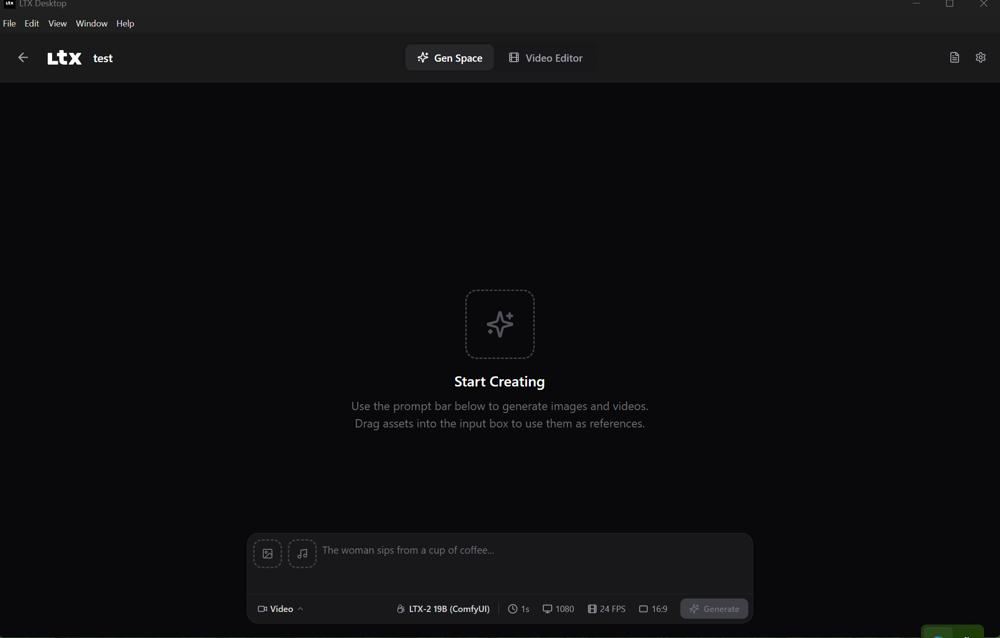
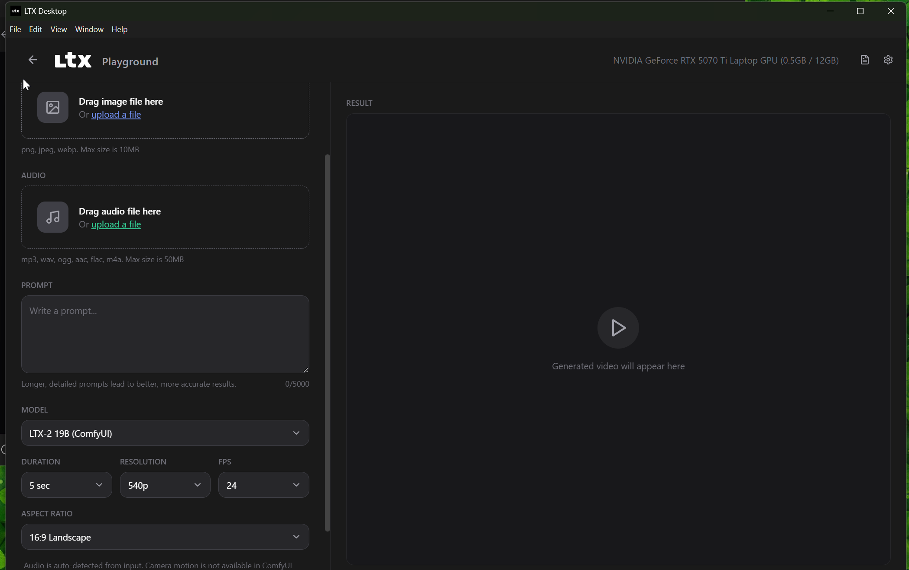
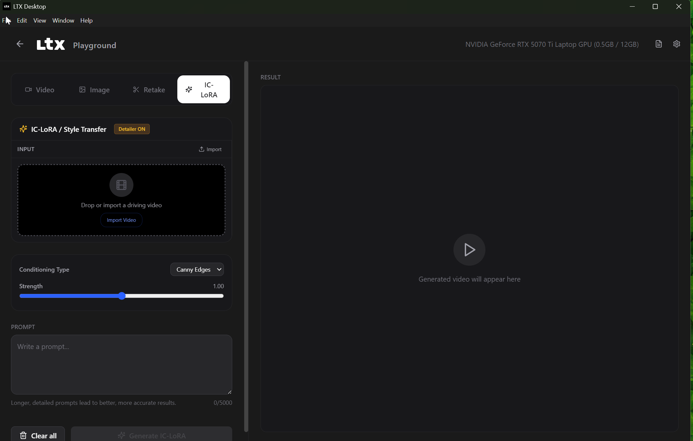

# LTX Desktop + ComfyUI Integration

LTX Desktop with a built-in ComfyUI proxy layer that routes all generation (video, image, audio-video, IC-LoRA, retake) through local ComfyUI workflows using GGUF-quantized models.

> **Status: Beta.** Expect breaking changes.

<p align="center">
  
</p>

<p align="center">
  
  
</p>

## Features

### Generation Modes (via ComfyUI)

| Mode | Workflow | Model |
|------|----------|-------|
| **Text-to-Video (T2V)** | `av_movie.json` | LTX-2 19B GGUF (Q4_K_M) |
| **Image-to-Video (I2V)** | `av_movie.json` | LTX-2 19B + guide image |
| **Audio-to-Video (A2V)** | `av_movie.json` | LTX-2 19B + audio VAE |
| **Text-to-Image** | `image_scene.json` | Flux Kontext GGUF (Q8_0) |
| **Character Image** | `image_character.json` | Flux Kontext GGUF (Q8_0) |
| **IC-LoRA (Depth)** | `av_movie.json` + LoRA | Depth control LoRA |
| **IC-LoRA (Canny)** | `av_movie.json` + LoRA | Canny control LoRA |
| **IC-LoRA (Pose)** | `av_movie.json` + LoRA | Pose control LoRA |
| **IC-LoRA (Detailer)** | `av_movie.json` + LoRA | Detailer enhancement LoRA |
| **Retake (Temporal Inpainting)** | `retake_inpaint.json` | LTX-2 19B + distilled LoRA |

### Additional Features

- ComfyUI auto-starts in the background when needed
- Auto-detect and download missing models from HuggingFace
- All native LTX Desktop features (editor, timeline, export) still work
- Toggle between ComfyUI and native pipelines in Settings
- Progress tracking during generation
- Seed lock support
- Resolution: 360p to 1080p
- Duration: 1s to 10s
- FPS: 6, 12, 18, 24, 30

---

## Directory Structure (Required Layout)

**ComfyUI and LTX-Desktop must be siblings under the same parent directory.** The backend resolves paths by walking up from `backend/_services/` to find the parent root, then looks for `ComfyUI/` and `.venv/` as siblings.

```
<root>\                               # e.g. D:\.comfyui\
├── ComfyUI\                          # ComfyUI installation (MUST be sibling of LTX-Desktop)
│   ├── main.py
│   ├── input\                        # Input files (images, audio, video)
│   ├── output\                       # Generated outputs
│   └── models\                       # All model files (see below)
│       ├── unet\
│       ├── clip\
│       ├── text_encoders\
│       ├── vae\
│       ├── loras\
│       └── latent_upscale_models\
├── .venv\                            # Python venv with ComfyUI dependencies
├── LTX-Desktop\                      # This repo
│   ├── backend\
│   │   ├── _services\
│   │   │   ├── comfyui_client.py     # HTTP client for ComfyUI API
│   │   │   ├── comfyui_workflows.py  # Workflow template builders
│   │   │   ├── comfyui_process.py    # Auto-start ComfyUI subprocess
│   │   │   ├── comfyui_model_manager.py  # Model status & download
│   │   │   └── workflows\           # Workflow JSON templates
│   │   │       ├── av_movie.json     # Video/AV generation
│   │   │       ├── image_scene.json  # Flux scene image
│   │   │       ├── image_character.json  # Flux character image
│   │   │       └── retake_inpaint.json   # Temporal inpainting
│   │   └── _routes\
│   │       └── comfyui_proxy.py      # API endpoints (/api/comfyui/*)
│   └── frontend\
│       ├── hooks\
│       │   ├── use-generation.ts     # Routes to ComfyUI when enabled
│       │   ├── use-retake.ts         # ComfyUI retake support
│       │   └── use-ic-lora.ts        # ComfyUI IC-LoRA support
│       ├── components\
│       │   ├── SettingsPanel.tsx      # ComfyUI-aware settings
│       │   ├── SettingsModal.tsx      # ComfyUI toggle + URL config
│       │   └── ICLoraPanel.tsx        # IC-LoRA with detailer toggle
│       └── contexts\
│           └── AppSettingsContext.tsx  # comfyuiEnabled + comfyuiUrl
├── gen.video\                        # Original video workflows (reference)
├── gen.av\                           # Original AV workflows (reference)
├── gen.image\                        # Original image workflows (reference)
└── gen.audio\                        # Original audio workflows (reference)
```

### Environment Variable Overrides

If your ComfyUI is installed elsewhere, set these env vars before running `pnpm dev`:

| Variable | Default | Purpose |
|----------|---------|---------|
| `COMFYUI_DIR` | `<root>/ComfyUI` | Path to ComfyUI installation |
| `COMFYUI_BASE_URL` | `http://127.0.0.1:8188` | ComfyUI HTTP URL |
| `COMFYUI_VENV_PYTHON` | `<root>/.venv/Scripts/python.exe` | Python executable with ComfyUI deps |

Example:
```bash
set COMFYUI_DIR=E:\MyComfyUI
set COMFYUI_VENV_PYTHON=E:\MyComfyUI\venv\Scripts\python.exe
pnpm dev
```

---

## Setup from Scratch

### Prerequisites

- **Windows 10/11** with NVIDIA GPU (CUDA support)
- **Node.js** 18+ and **pnpm**
- **Python 3.12+**
- **uv** (Python package manager): `pip install uv`
- **Git**

### Step 1: Clone and Install

```bash
# Clone the repo
cd D:\.comfyui
git clone <repo-url> LTX-Desktop
cd LTX-Desktop

# Install frontend dependencies
pnpm install

# Create backend Python venv
cd backend
uv sync
cd ..
```

### Step 2: Install ComfyUI

```bash
cd D:\.comfyui

# Clone ComfyUI
git clone https://github.com/comfyanonymous/ComfyUI.git

# Create a shared venv for ComfyUI
python -m venv .venv
.venv\Scripts\activate

# Install ComfyUI dependencies
pip install torch torchvision torchaudio --index-url https://download.pytorch.org/whl/cu128
pip install -r ComfyUI\requirements.txt

# Install required custom nodes
# ComfyUI-GGUF (for GGUF model loading)
cd ComfyUI\custom_nodes
git clone https://github.com/city96/ComfyUI-GGUF.git
pip install -r ComfyUI-GGUF\requirements.txt

# VideoHelperSuite (for VHS_LoadVideo, VHS_VideoCombine)
git clone https://github.com/Kosinkadink/ComfyUI-VideoHelperSuite.git
pip install -r ComfyUI-VideoHelperSuite\requirements.txt

cd D:\.comfyui
deactivate
```

### Step 3: Download Models

All models go in `D:\.comfyui\ComfyUI\models\`. The app can auto-download missing models via `POST /api/comfyui/models/download`, or you can download manually:

#### UNet / Diffusion Models

| File | Size | Location | Source |
|------|------|----------|--------|
| `ltx-2-19b-distilled_Q4_K_M.gguf` | ~10 GB | `models/unet/` | [Kijai/LTXV2_comfy](https://huggingface.co/Kijai/LTXV2_comfy) |
| `flux1-kontext-dev-Q8_0.gguf` | ~12.7 GB | `models/unet/` | [QuantStack/FLUX.1-Kontext-dev-GGUF](https://huggingface.co/QuantStack/FLUX.1-Kontext-dev-GGUF) |

#### CLIP / Text Encoders

| File | Size | Location | Source |
|------|------|----------|--------|
| `gemma_3_12B_it_fp8_e4m3fn.safetensors` | ~12 GB | `models/text_encoders/` | [Kijai/LTXV2_comfy](https://huggingface.co/Kijai/LTXV2_comfy) |
| `ltx-2-19b-embeddings_connector_distill_bf16.safetensors` | ~1.5 GB | `models/clip/` | [Kijai/LTXV2_comfy](https://huggingface.co/Kijai/LTXV2_comfy) |
| `t5xxl_fp8_e4m3fn.safetensors` | ~4.9 GB | `models/clip/` | [comfyanonymous/flux_text_encoders](https://huggingface.co/comfyanonymous/flux_text_encoders) |
| `clip_l.safetensors` | ~246 MB | `models/clip/` | [comfyanonymous/flux_text_encoders](https://huggingface.co/comfyanonymous/flux_text_encoders) |

#### VAE

| File | Size | Location | Source |
|------|------|----------|--------|
| `LTX2_video_vae_bf16.safetensors` | ~330 MB | `models/vae/` | [Kijai/LTXV2_comfy](https://huggingface.co/Kijai/LTXV2_comfy) |
| `LTX2_audio_vae_bf16.safetensors` | ~330 MB | `models/vae/` | [Kijai/LTXV2_comfy](https://huggingface.co/Kijai/LTXV2_comfy) |
| `flux_kontext_vae.safetensors` | ~335 MB | `models/vae/` | [black-forest-labs/FLUX.1-dev](https://huggingface.co/black-forest-labs/FLUX.1-dev) |

#### LoRAs

| File | Size | Location | Source |
|------|------|----------|--------|
| `ltx-2-19b-ic-lora-depth-control.safetensors` | ~625 MB | `models/loras/` | [Lightricks/LTX-2](https://huggingface.co/Lightricks/LTX-2) |
| `ltx-2-19b-ic-lora-canny-control.safetensors` | ~625 MB | `models/loras/` | [Lightricks/LTX-2](https://huggingface.co/Lightricks/LTX-2) |
| `ltx-2-19b-ic-lora-pose-control.safetensors` | ~625 MB | `models/loras/` | [Lightricks/LTX-2](https://huggingface.co/Lightricks/LTX-2) |
| `ltx-2-19b-ic-lora-detailer.safetensors` | ~2.5 GB | `models/loras/` | [Lightricks/LTX-2](https://huggingface.co/Lightricks/LTX-2) |
| `ltx-2-19b-distilled-lora-384.safetensors` | ~7.67 GB | `models/loras/` | [Lightricks/LTX-2](https://huggingface.co/Lightricks/LTX-2) |

#### Upscalers

| File | Size | Location | Source |
|------|------|----------|--------|
| `ltx-2-spatial-upscaler-x2-1.0.safetensors` | ~996 MB | `models/latent_upscale_models/` | [Lightricks/LTX-2](https://huggingface.co/Lightricks/LTX-2) |
| `ltx-2-temporal-upscaler-x2-1.0.safetensors` | ~262 MB | `models/latent_upscale_models/` | [Lightricks/LTX-2](https://huggingface.co/Lightricks/LTX-2) |

**Total model size: ~55 GB**

#### Quick Download (using huggingface_hub)

```bash
# Activate ComfyUI venv
cd D:\.comfyui
.venv\Scripts\activate

pip install huggingface_hub

# Download all models (run from ComfyUI/models directory)
cd ComfyUI\models

# UNet
huggingface-cli download Kijai/LTXV2_comfy diffusion_models/ltx-2-19b-distilled_Q4_K_M.gguf --local-dir unet
huggingface-cli download QuantStack/FLUX.1-Kontext-dev-GGUF FLUX.1-Kontext-dev-Q8_0.gguf --local-dir unet

# Text Encoders
huggingface-cli download Kijai/LTXV2_comfy text_encoders/gemma_3_12B_it_fp8_e4m3fn.safetensors --local-dir text_encoders
huggingface-cli download Kijai/LTXV2_comfy text_encoders/ltx-2-19b-embeddings_connector_distill_bf16.safetensors --local-dir clip
huggingface-cli download comfyanonymous/flux_text_encoders t5xxl_fp8_e4m3fn.safetensors --local-dir clip
huggingface-cli download comfyanonymous/flux_text_encoders clip_l.safetensors --local-dir clip

# VAE
huggingface-cli download Kijai/LTXV2_comfy vae/LTX2_video_vae_bf16.safetensors --local-dir vae
huggingface-cli download Kijai/LTXV2_comfy vae/LTX2_audio_vae_bf16.safetensors --local-dir vae
# Flux VAE: download from black-forest-labs/FLUX.1-dev vae/diffusion_pytorch_model.safetensors and rename to flux_kontext_vae.safetensors

# LoRAs
huggingface-cli download Lightricks/LTX-2 ltx-2-19b-ic-lora-depth-control.safetensors --local-dir loras
huggingface-cli download Lightricks/LTX-2 ltx-2-19b-ic-lora-canny-control.safetensors --local-dir loras
huggingface-cli download Lightricks/LTX-2 ltx-2-19b-ic-lora-pose-control.safetensors --local-dir loras
huggingface-cli download Lightricks/LTX-2 ltx-2-19b-ic-lora-detailer.safetensors --local-dir loras
huggingface-cli download Lightricks/LTX-2 ltx-2-19b-distilled-lora-384.safetensors --local-dir loras

# Upscalers
huggingface-cli download Lightricks/LTX-2 ltx-2-spatial-upscaler-x2-1.0.safetensors --local-dir latent_upscale_models
huggingface-cli download Lightricks/LTX-2 ltx-2-temporal-upscaler-x2-1.0.safetensors --local-dir latent_upscale_models

deactivate
```

### Step 4: Verify Setup

```bash
# Test ComfyUI starts
cd D:\.comfyui
.venv\Scripts\python.exe ComfyUI\main.py --listen --async-offload 16

# Should see: "Starting server" on http://0.0.0.0:8188
# Open http://127.0.0.1:8188 in browser to verify
# Ctrl+C to stop
```

### Step 5: Run LTX Desktop

```bash
cd D:\.comfyui\LTX-Desktop
pnpm dev
```

1. Open the app
2. Go to **Settings** (gear icon) > **General**
3. Toggle **Enable ComfyUI Proxy** on
4. (Optional) Change ComfyUI URL if not `http://127.0.0.1:8188`
5. Start generating!

ComfyUI will auto-start in the background when you generate for the first time.

---

## API Endpoints

All ComfyUI proxy endpoints are under `/api/comfyui/`:

| Endpoint | Method | Purpose |
|----------|--------|---------|
| `/api/comfyui/health` | GET | Check ComfyUI availability |
| `/api/comfyui/progress` | GET | Poll generation progress |
| `/api/comfyui/models/status` | GET | Check which models are installed |
| `/api/comfyui/models/download` | POST | Download missing models |
| `/api/comfyui/generate/video` | POST | Generate video (T2V / I2V) |
| `/api/comfyui/generate/av` | POST | Generate audio-video (A2V) |
| `/api/comfyui/generate/image` | POST | Generate image (Flux) |
| `/api/comfyui/generate/raw` | POST | Submit raw workflow JSON |
| `/api/comfyui/retake` | POST | Temporal inpainting (retake) |
| `/api/comfyui/ic-lora/generate` | POST | IC-LoRA conditioned generation |

---

## ComfyUI Startup Flags

The auto-start uses these flags (same as `comfyui.bat`):

```
python ComfyUI\main.py --listen --async-offload 16 --cache-none --disable-smart-memory --reserve-vram 0.3
```

| Flag | Purpose |
|------|---------|
| `--listen` | Listen on all interfaces |
| `--async-offload 16` | Async model offloading (16 layers) |
| `--cache-none` | Disable caching for lower VRAM |
| `--disable-smart-memory` | Disable smart memory management |
| `--reserve-vram 0.3` | Reserve 0.3 GB VRAM for system |

---

## Switching Between ComfyUI and Native Mode

All ComfyUI integration is toggle-based. When **ComfyUI is OFF**, the app works exactly like the original LTX Desktop with native pipelines and API keys.

When **ComfyUI is ON**:
- Settings hides: API keys, inference, prompt enhancer, text encoding, torch compile, model preload
- Settings shows: ComfyUI toggle, URL config
- Generation routes through ComfyUI workflows
- Models are loaded by ComfyUI (not the native pipeline)
- All editor features (regenerate, I2V, gap fill) use ComfyUI
- IC-LoRA panel shows Input only (no conditioning preview column)
- Camera motion and audio on/off toggles are hidden

---

## Troubleshooting

### ComfyUI won't start
- Check the `.venv` exists at `D:\.comfyui\.venv\Scripts\python.exe`
- Try starting manually: `D:\.comfyui\.venv\Scripts\python.exe ComfyUI\main.py --listen`
- Check for port conflicts on 8188

### Models not found
- Run `GET /api/comfyui/models/status` to see which are missing
- Run `POST /api/comfyui/models/download` to auto-download
- Or download manually using the table above

### Generation fails with 400/502
- Check ComfyUI console for node validation errors
- Ensure all required custom nodes are installed (ComfyUI-GGUF, VideoHelperSuite)
- Verify model files are in the correct directories

### Backend won't start (LTX Desktop)
- Ensure `backend/.venv` exists: `cd backend && uv sync`
- Or create a junction: `mklink /J backend\.venv D:\.comfyui\.venv` (if using shared venv)

---

## License

Licensed under the Apache License, Version 2.0. See [LICENSE](LICENSE).

LTX-2 model weights are subject to the [LTX-2 Community License Agreement](https://huggingface.co/Lightricks/LTX-2/blob/main/LICENSE).
